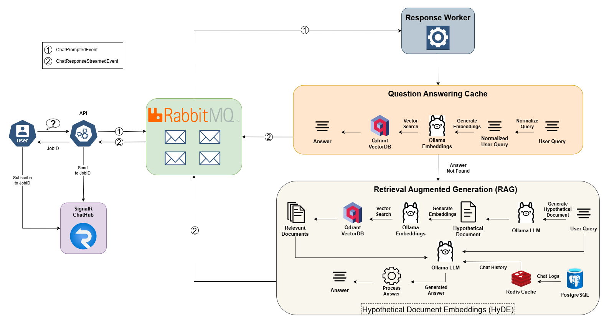

# FlexiBOT - Cloud-Agnostic RAG Chatbot

[](https://vscode.dev/redirect?url=vscode://ms-vscode-remote.remote-containers/cloneInVolume?url=https://github.com/ThanosM97/flexibot-dotnet.git)

Implementation of an asynchronous, event-driven RAG chatbot using ASP.NET Core. It also leverages a semantic cache layer for question-answer lookup.

## Features

- **QnA Semantic Cache**: Predefined Question-Answer pairs for quick answer retrieval using semantic search
- **RAG Pattern Implementation**: Document ingestion and question answering with augmented generation
- **Event-Driven Architecture**: RabbitMQ for asynchronous processing
- **Modular Workers**: Independent services for document processing pipelines
- **Cloud-Neutral Storage**: MinIO (S3-compatible) for object storage
- **Vector Search**: Qdrant vector database for semantic search
- **Open Source Models**: Ollama integration for embeddings and LLM
- **Conversation History Cache**: Redis cache for efficient storage and retrieval of chat conversation history
- **Chat Logs**: PostgreSQL database for storing chat interactions, enabling cache reconstruction after expiration

## Architecture Overview
The architecture diagram below outlines the question-answering flow of FlexiBOT. You can find corresponding diagrams for the document upload and QnA CSV file upload processes [here](./docs/diagrams/).




## Solution Structure
Below is a brief presentation of the solution structure. The in-depth structure can be found in [project-structure.md](./docs/project-structure.md).

```plaintext
src/
├── Api                         # All API-related components.
│   ├── Api.csproj
│   ├── appsettings.json
│   ├── Controllers/            # Handles HTTP requests.
│   ├── Hubs/                   # SignalR Hubs for real-time communication.
│   ├── Program.cs
│   └── Services/
├── Shared                      # Shared components, interfaces, and utilities.
│   ├── Database/               # SQL scripts and database-related services.
│   ├── Events/                 # Event definitions for event-driven architecture.
│   ├── Factories/              # Factories for creating service instances.
│   ├── Interfaces/             # Interfaces define contracts for the services.
│   ├── Models/                 # Models represent data structures used across services.
│   ├── Prompts/                # Templates for prompts used in RAG services.
│   ├── Services/               # Implementation of service functionalities.
│   ├── Shared.csproj
│   └── Utils/                  # Utilities providing helper functions and logic.
└── Workers                     # Directory containing worker service components.
    ├── ChunkerWorker/          # Worker handling RAG document chunking.
    ├── DeleterWorker/          # Worker handling RAG document deletions.
    ├── EmbedderWorker/         # Worker for generating RAG document embeddings.
    ├── IndexerWorker/          # Worker for indexing RAG documents into the vector database.
    ├── ParserWorker/           # Worker for parsing RAG documents into text.
    ├── QnAWorker/              # Worker for handling QnA-related tasks.
    ├── ResponseWorker/         # Worker for generating responses to chat queries.
    └── StatusWorker/           # Worker for updating document processing status.
```

### Core Components

1. **API Layer**:
   - Handles document actions (e.g., uploads) and user queries
   - Real-time updates via SignalR
   - Publishes events to RabbitMQ

2. **Processing Workers**:
   - **Parser**: File text extraction
   - **Chunker**: Document segmentation
   - **Embedder**: Embeddng vector generation
   - **Indexer**: Qdrant knowledge base update
   - **Deleter**: Document removal
   - **Status**: Document metadata status update
   - **QnA**: CSV processing for the QnA semantic cache
   - **Response**: Chat response generation

3. **Services**:
   - Message queue (**RabbitMQ**)
   - Vector database (**Qdrant**)
   - Metadata and chat logs storage (**PostgreSQL**)
   - Object storage (**MinIO**)
   - Model serving (**Ollama**)
   - Conversation history cache (**Redis**)

## Getting Started

### Prerequisites

- Docker
- VS Code with Dev Containers extension
- .NET 8 SDK

### Installation

1. Clone repository:
   ```bash
   git clone https://github.com/ThanosM97/flexibot-dotnet.git
   ```
2. Open in VS Code and reopen in container


### Configuration

Environment variables are set in [docker-compose.yml](./.devcontainer/docker-compose.yml).

A sample of the variables that need to be set:

| Category        | Key                          | Default Value           |
|-----------------|------------------------------|-------------------------|
| Database        | `ConnectionStrings__Postgres`| Host=postgres;Port=5432 |
| Vector DB       | `QDRANT__HOST`               | qdrant                  |
| Storage         | `MINIO__ENDPOINT`            | minio:9000              |
| Storage         | `MINIO__QNA_BUCKET`          | qna                     |
| LLM             | `OLLAMA__LLM_MODEL`          | llama3.2:1b             |
| RAG             | `RAG__METHOD`                | simple                  |

The full list of the available configurations can be found in [configurations.md](docs/configurations.md).

### Running the Application

1. Start all services:
   ```bash
   docker-compose up -d
   ```

2. Before running the application, you first need to manually create the `documents` and `chat_logs` tables in PostgreSQL (use the DDL scripts provided [here](./src/Shared/Database/)) and the buckets for MinIO with the names defined in the environmental variables (default bucket names: `qna` and `documents`).

3. Run workers (from src/ directory):
   ```bash
   dotnet run --project Workers/ParserWorker
   dotnet run --project Workers/EmbedderWorker
   # Repeat for other workers
   ```

4. Start API:
   ```bash
   dotnet run --project Api
   ```

5. Access the user and administrator interfaces ([screenshots](docs/client-ui/)):
   - To engage with the chat interface, navigate to: http://127.0.0.1:5229/chat.html
   - For administrative functions (document upload), visit: http://127.0.0.1:5229/admin.html

## API Usage

### Endpoints

#### Document Management
- **`POST /api/admin/documents/upload `**– Upload RAG documents (e.g., DOCX, PDF)
- **`GET /api/admin/documents/status/{jobId}`** – Get the status of a document processing job
- **`GET /api/admin/documents/list`** – List all uploaded documents
- **`GET /api/admin/documents/download/{documentId}`** – Download a specific document
- **`DELETE /api/admin/documents/delete/{documentId}`** – Delete a specific document

#### QnA Management
- **`POST /api/admin/qna/upload`** – Upload QnA CSV files
- **`GET /api/admin/qna/download`** – Download the QnA file
- **`DELETE /api/admin/qna/delete`** – Delete the QnA file

#### Chatbot Interaction
- **`POST /api/chat`** – Submit questions for the chatbot
- **`/api/chathub`** – SignalR hub for real-time response streaming


### Example Requests

You can explore all of the available example requests in the [.restclient](/.restclient) directory.

#### **Chat Request**
```http
POST /api/chat HTTP/1.1
Content-Type: application/json

{
   "sessionId": "<GUID>",
   "prompt": "Can you explain how retrieval-augmented generation works?"
}
```

## Development Environment

### Dev Container Setup

The `.devcontainer` includes:

- .NET 8 SDK
- Required services:
  - Qdrant (6333/tcp)
  - RabbitMQ (5672/tcp)
  - PostgreSQL (5432/tcp)
  - MinIO (9000/tcp)
  - Ollama (11434/tcp)
  - Redis (6379/tcp)

Access services at:
- MinIO Console: `http://localhost:9001`
- RabbitMQ Management: `http://localhost:15672`
- Qdrant Dashboard: `http://localhost:6333/dashboard`

### Recommended Extensions

- C# Dev Kit
- Roslynator
- REST Client
- Docker
- **GitHub Copilot** (A good portion of this codebase, including most of the comments, was written using GitHub Copilot's autocompletion feature. Good times.)

## Future Enhancements

- [ ] Advanced document processing
- [ ] Automated question-answer extraction from ingested documents for the semantic cache
- [ ] Guard rails (content filtering)
- [ ] Running summary of conversation history
- [ ] Fault tolerance patterns (Retries/Circuit Breakers)